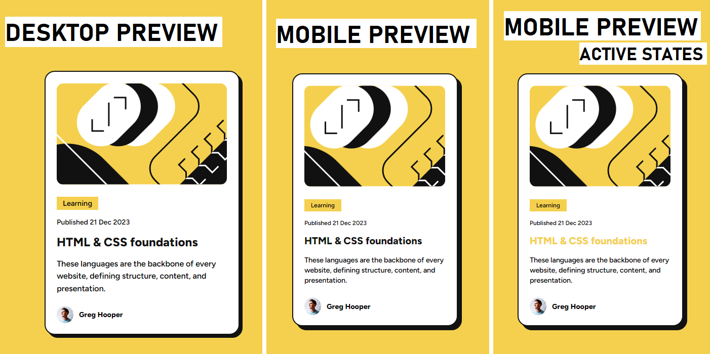

# Frontend Mentor - Blog preview card

## Welcome! 👋

My challenge was to build out a blog preview card and get it looking as close to the design as possible. I could use any tools I liked to help me complete the challenge. So if I had something I wanted to practice, I was free to give it a go.

I ensured that my users could: 
- See hover and focus states for all interactive elements on the page.

## Table of contents

- [Overview](#overview)
  - [The challenge](#the-challenge)
  - [Screenshot](#screenshot)
  - [Links](#links)
- [Author](#author)

## Overview

### The challenge

The given sentence translates to: “This challenge was a great opportunity for me to practice basic HTML and CSS tags.

### Screenshot

### Links

- Solution URL: [GITHUB SOURCE](https://github.com/pettik/FrontendMentor--blog-preview-card)
- Live Site URL: [LIVE SITE 🌐](https://pettik-blog-preview-card.netlify.app/)

## Author

- Website - [Petr Bednarski](https://github.com/pettik)
- Frontend Mentor - [@pettik](https://www.frontendmentor.io/profile/pettik)
